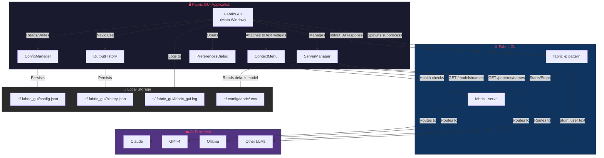
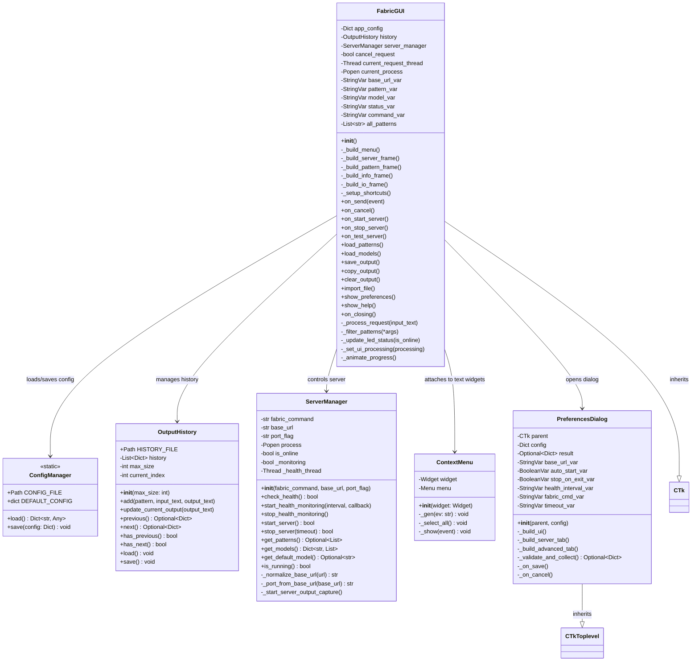
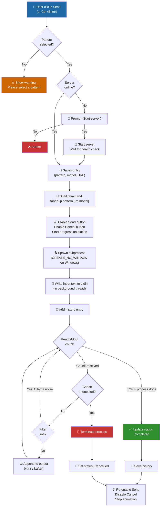
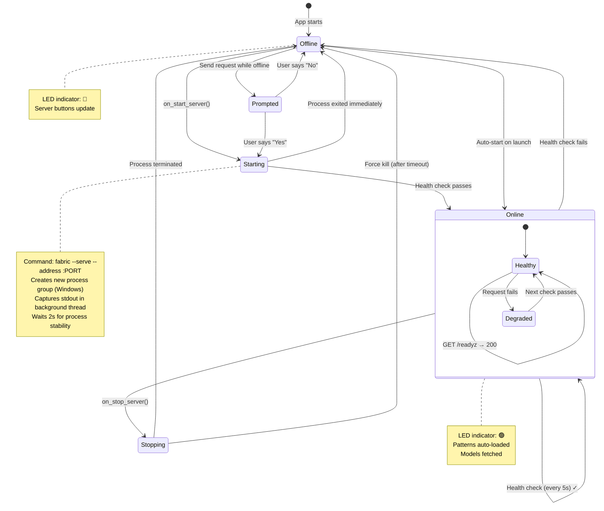
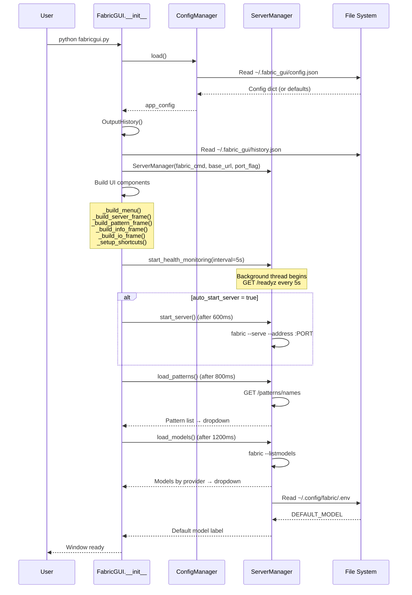
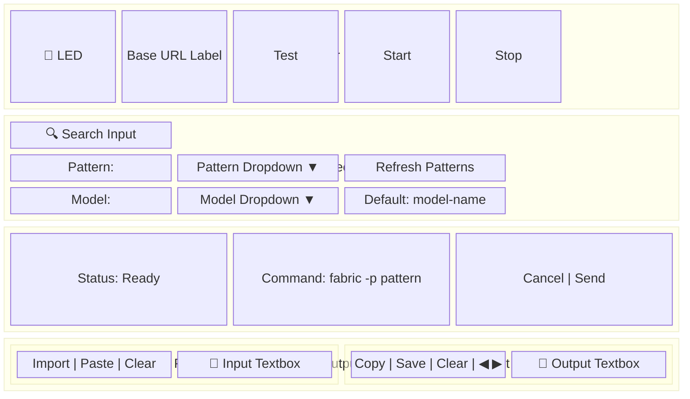

<p align="center">
  <h1 align="center">🧵 Fabric Mini GUI</h1>
  <p align="center">
    A modern desktop client for interacting with <a href="https://github.com/danielmiessler/fabric">Fabric</a> AI patterns
    <br />
    Built with <strong>CustomTkinter</strong> for a sleek, dark-mode friendly experience
  </p>
</p>

<p align="center">
  
  
  
  
</p>

---

## Table of Contents

- [Overview](#overview)
- [Architecture](#architecture)
  - [System Architecture](#system-architecture)
  - [Class Diagram](#class-diagram)
  - [Request Processing Flow](#request-processing-flow)
  - [Server Lifecycle](#server-lifecycle)
  - [Application Startup Sequence](#application-startup-sequence)
  - [GUI Layout Structure](#gui-layout-structure)
- [Features](#features)
- [Installation](#installation)
- [Usage](#usage)
  - [First Time Setup](#first-time-setup)
  - [Sending Requests](#sending-requests)
  - [Managing Output](#managing-output)
  - [Managing the Server](#managing-the-server)
  - [Cancelling Requests](#cancelling-requests)
- [Configuration](#configuration)
- [Keyboard Shortcuts](#keyboard-shortcuts)
- [Menu Reference](#menu-reference)
- [Project Structure](#project-structure)
- [Logging](#logging)
- [Troubleshooting](#troubleshooting)
- [Version History](#version-history)
- [Contributing](#contributing)
- [Credits](#credits)

---

## Overview

**Fabric Mini GUI** provides a graphical desktop interface for the [Fabric](https://github.com/danielmiessler/fabric) AI framework by Daniel Miessler. Instead of using the Fabric CLI directly, you get a modern dark-mode window where you can:

- Browse and search AI patterns visually
- Select from all your configured AI models (Claude, GPT-4, Ollama, etc.)
- Stream AI responses in real-time
- Manage the Fabric server with start/stop controls and live health monitoring
- Navigate through your response history

The entire application is a single Python file (`fabricgui.py`) with only two dependencies: `requests` and `customtkinter`.

---

## Architecture

### System Architecture

High-level view of how Fabric GUI interacts with the Fabric ecosystem:



### Class Diagram

Detailed view of all classes, their fields, and relationships:



### Request Processing Flow

Step-by-step view of what happens when the user clicks **Send**:



### Server Lifecycle

How `ServerManager` controls the Fabric server process:



### Application Startup Sequence

What happens when the application launches:



### GUI Layout Structure

Visual map of how the UI panels are organized:



---

## Features

### ✨ Core Functionality

- **Pattern selection and execution** via Fabric CLI subprocess
- **Real-time streaming responses** — output appears chunk-by-chunk as the AI generates it
- **Model selection** — browse all configured AI models grouped by provider
- **Command preview** — see the exact `fabric` command before executing

### 🎨 Modern User Interface

- **CustomTkinter** integration for a modern, dark-mode friendly aesthetic
- Clean, intuitive layout with organized frames
- **Animated progress indicator** with pulsing gold dots during processing
- Output toolbar (Copy, Save, Clear)
- History navigation (◀/▶ buttons)
- Status bar with visual feedback
- **Context Menus** — right-click support for Cut/Copy/Paste/Select All
- **Interactive Pattern Search** — real-time filtering with match count display

### 🖥️ Server Management

- Visual LED status indicator (🔴 offline / 🟢 online)
- Start/Stop server controls directly from the GUI
- Automatic health monitoring (configurable interval, default 5s)
- **Auto-Load Patterns** — patterns and models load automatically when server comes online
- Pre-request server validation with auto-start prompt
- Graceful shutdown handling with force-kill fallback

### ⚙️ Configuration

- Persistent settings via JSON (auto-saved)
- Tabbed Preferences dialog (Server + Advanced)
- Configurable server URL, health check interval, and request timeout
- Window geometry persistence across sessions

### 📝 Output Management

- Copy output to clipboard
- Save output to file (TXT/MD)
- Clear output display
- Navigate through response history (up to 50 entries, persisted to disk)

### 📁 File Import

- Import `.txt` or `.md` files directly into the input box via the Import button

---

## Installation

### Requirements

- Python 3.11+
- [Fabric](https://github.com/danielmiessler/fabric) CLI installed and on PATH
- `requests` library
- `customtkinter` library

### Quick Start (Windows)

1. Clone or download this repository
2. Double-click `start.bat`
   - First run: creates a virtual environment, installs dependencies, and launches the app
   - Subsequent runs: activates the venv and launches immediately

### Manual Setup

```bash
# Clone the repository
git clone https://github.com/Digitalgods2/FabricGui.git
cd FabricGui

# Install dependencies
pip install -r requirements.txt

# Run the application
python fabricgui.py
```

### Build Standalone Executable

```bash
pip install pyinstaller
pyinstaller fabricgui.spec
```

The standalone `FabricGUI.exe` will be created in the `dist/` folder (no console window).

---

## Usage

### First Time Setup

1. **Configure Server**
   - The default server URL is `http://localhost:8083`
   - Open **Edit → Preferences** to change the URL or other settings
   - Click **Test** to verify connectivity

2. **Start the Server**
   - Click **Start** to launch Fabric's built-in server
   - Wait for the LED indicator to turn 🟢 green
   - Patterns and models load automatically

3. **Select Your Model**
   - The Model dropdown shows all available AI models grouped by provider
   - Click the "Default: ..." label to reset to your configured default model

### Sending Requests

1. Select a pattern from the dropdown (use the search box to filter)
2. Enter your input text (or click **Import** to load a file)
3. Review the command preview
4. Click **Send** or press `Ctrl+Enter`
5. Watch the response stream in the output panel

### Managing Output

| Action | Button | Shortcut |
|---|---|---|
| Copy to clipboard | **Copy** | `Ctrl+C` |
| Save to file | **Save** | `Ctrl+S` |
| Clear display | **Clear** | — |
| Previous history | **◀** | `Alt+Left` |
| Next history | **▶** | `Alt+Right` |

### Managing the Server

**Status Indicators:**

| LED | Meaning |
|---|---|
| 🔴 Red | Server offline |
| 🟢 Green | Server online |

**Auto-Start:** Enable in Preferences to start the server automatically on app launch.

**Pre-Request Validation:** If the server is offline when you send a request, the app prompts: *"Would you like to start it now?"*

### Cancelling Requests

Click the **Cancel** button during processing. The subprocess will be terminated gracefully (or force-killed after a timeout).

---

## Configuration

Settings are stored at `~/.fabric_gui/config.json` and auto-saved:

```json
{
  "base_url": "http://localhost:8083",
  "last_pattern": "",
  "last_model": "",
  "window_geometry": "1200x800",
  "auto_start_server": false,
  "stop_server_on_exit": true,
  "server_health_check_interval": 5,
  "request_timeout": 300,
  "fabric_command": "fabric",
  "port_flag": "--address"
}
```

| Setting | Default | Description |
|---|---|---|
| `base_url` | `http://localhost:8083` | Fabric server address |
| `auto_start_server` | `false` | Launch server on app start |
| `stop_server_on_exit` | `true` | Prompt to stop server on close |
| `server_health_check_interval` | `5` | Health check frequency (seconds) |
| `request_timeout` | `300` | Max processing time (seconds) |
| `fabric_command` | `fabric` | Path to Fabric executable |
| `port_flag` | `--address` | Server bind flag (auto-corrected from `--port`) |

---

## Keyboard Shortcuts

| Shortcut | Action |
|---|---|
| `Ctrl+Enter` | Send request |
| `Ctrl+S` | Save output to file |
| `Ctrl+C` | Copy output to clipboard |
| `Ctrl+,` | Open Preferences |
| `Alt+Left` | Previous history entry |
| `Alt+Right` | Next history entry |
| Right-click | Context menu (Cut/Copy/Paste/Select All) |

---

## Menu Reference

| Menu | Item | Shortcut | Action |
|---|---|---|---|
| **File** | Save Output... | `Ctrl+S` | Save output to file |
| | Exit | — | Close application |
| **Edit** | Preferences... | `Ctrl+,` | Open settings dialog |
| | Copy Output | `Ctrl+C` | Copy to clipboard |
| | Clear Output | — | Clear output display |
| | Paste Input | — | Paste from clipboard |
| | Clear Input | — | Clear input text |
| **History** | Previous | `Alt+Left` | Previous response |
| | Next | `Alt+Right` | Next response |
| **Help** | User Guide | — | Comprehensive help window |
| | View Logs | — | Open log file |
| | About | — | Application info |

---

## Project Structure

```
FabricGui/
├── fabricgui.py          # Entire application (1,930 lines)
├── fabricgui.spec        # PyInstaller build configuration
├── requirements.txt      # Python dependencies
├── start.bat             # Windows quick-start launcher
├── README.md             # This file
├── .gitignore
└── build/                # PyInstaller build artifacts

Runtime files (created automatically):
~/.fabric_gui/
├── config.json           # Persistent configuration
├── history.json          # Response history (up to 50 entries)
└── fabric_gui.log        # Rotating log files (5 MB × 3 backups)
```

### Key Classes

| Class | Lines | Responsibility |
|---|---|---|
| `ConfigManager` | 248–314 | Loads/saves JSON config with defaults and migration |
| `OutputHistory` | 321–387 | Manages response history with persistence |
| `ServerManager` | 394–660 | Controls Fabric server process, health checks, pattern/model fetching |
| `ContextMenu` | 667–714 | Right-click Cut/Copy/Paste/Select All for any text widget |
| `PreferencesDialog` | 721–898 | Tabbed settings dialog with validation |
| `FabricGUI` | 905–1924 | Main window — all UI building, event handling, and request processing |

---

## Logging

Application logs are saved to `~/.fabric_gui/fabric_gui.log`

- **Max file size:** 5 MB per file
- **Backup files:** 3 rotated backups
- **Total max:** ~20 MB
- **View logs:** Help → View Logs

---

## Troubleshooting

### "Failed to reach server"

- Verify the Fabric server is running (LED should be 🟢)
- Check the base URL in Preferences
- Click **Test** to diagnose connectivity

### "Error loading patterns"

- Ensure the server is accessible and responding
- Check API key if required
- Review logs (**Help → View Logs**) for detailed error messages

### Request Timeout

- Increase timeout in **Edit → Preferences → Advanced**
- Check network connection
- Verify the server is responding (click **Test**)

### "Ollama Get ... connection refused"

- **This is normal** if you are not running a local Ollama instance
- The Fabric CLI automatically checks for local models on startup
- The GUI filters this message to keep output clean
- It does not affect cloud models (Claude, GPT-4, etc.)

### Server Won't Start

- Ensure `fabric` is installed and on your system PATH
- Try running `fabric --serve` in a terminal to see errors directly
- Check that the port (default 8083) is not already in use

---

## Version History

### Version 3.2 (Latest) 🚀

- ✅ **Interactive Pattern Search**: Real-time filtering with auto-selection of first match
- ✅ **Improved Readability**: Enhanced dropdown styling with better contrast, taller dropdowns (25 items)
- ✅ **UI Polish**: Consistent font sizing, status bar shows match count while searching

### Version 3.1

- ✅ **Reliable AI Processing**: Switched to direct subprocess execution for guaranteed correct output
- ✅ **Enhanced UI**: Vertical scrollbar on pattern dropdown, expanded list (40 items), increased fonts
- ✅ **Smarter Server Management**: Improved stop logic, better error handling
- ✅ **Bug Fixes**: Output buffering/hanging, encoding issues with emojis, filtered startup errors

### Version 3.0 ⭐ Major Update

- ✅ **CustomTkinter Migration**: Complete UI overhaul with modern look and dark mode
- ✅ **Context Menus**: Right-click support for text widgets
- ✅ **Bug Fixes**: Infinite pattern loading loop, endpoint fix, TypeError, startup crashes

### Version 2.1

- ✅ Server management with Start/Stop controls and LED indicator
- ✅ Automatic health monitoring and pre-request validation
- ✅ Auto-start server option and graceful shutdown
- ✅ Cross-platform process management

### Version 2.0

- ✅ Complete refactoring with improved architecture
- ✅ Configuration persistence, output history, request cancellation
- ✅ Progress indicators, menu system, keyboard shortcuts
- ✅ Comprehensive logging

### Version 1.0

- Basic Fabric pattern execution with input/output interface

---

## Contributing

Suggestions and improvements are welcome! Please ensure:

- Code follows existing style
- All features are tested
- Documentation is updated

---

## Credits

**Fabric GUI** designed and developed by [DigitalGods.ai](https://digitalgods.ai)

Built for the [Fabric](https://github.com/danielmiessler/fabric) AI framework by Daniel Miessler.

---

**Happy pattern processing! 🚀**
